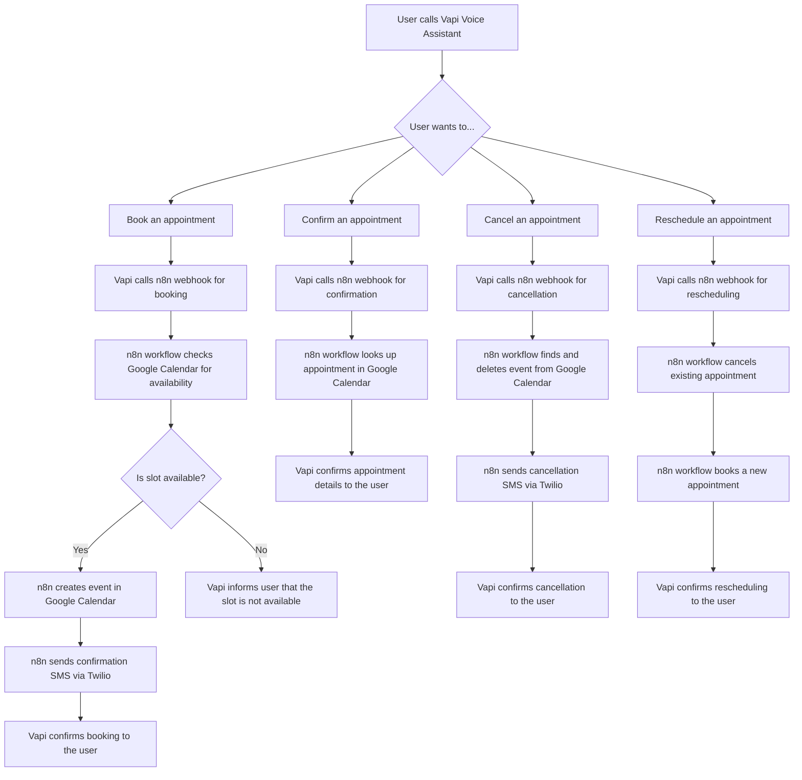
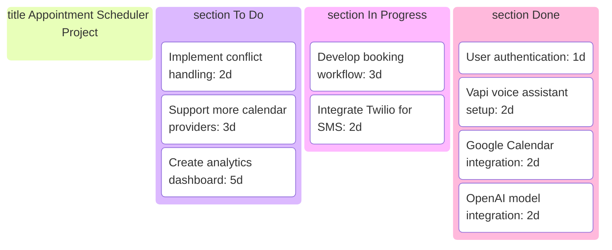
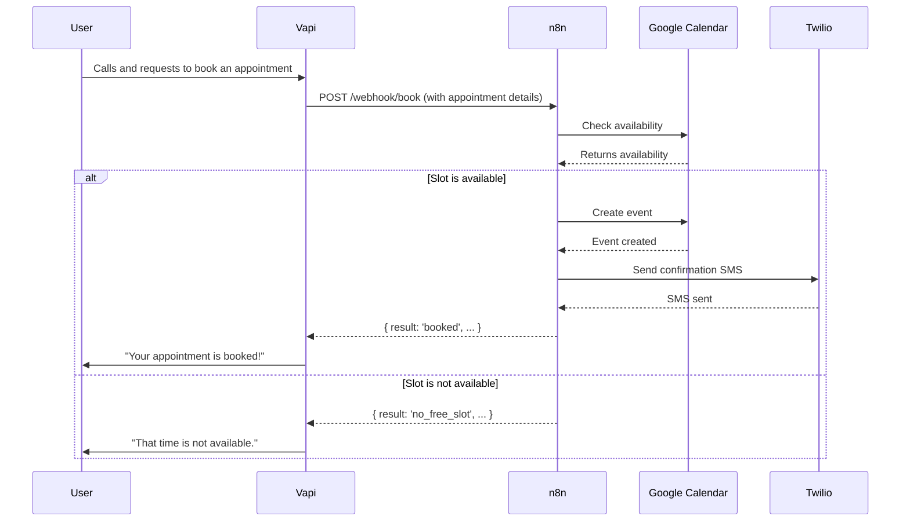
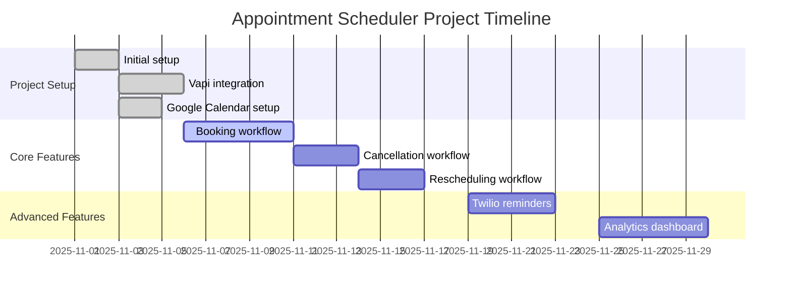
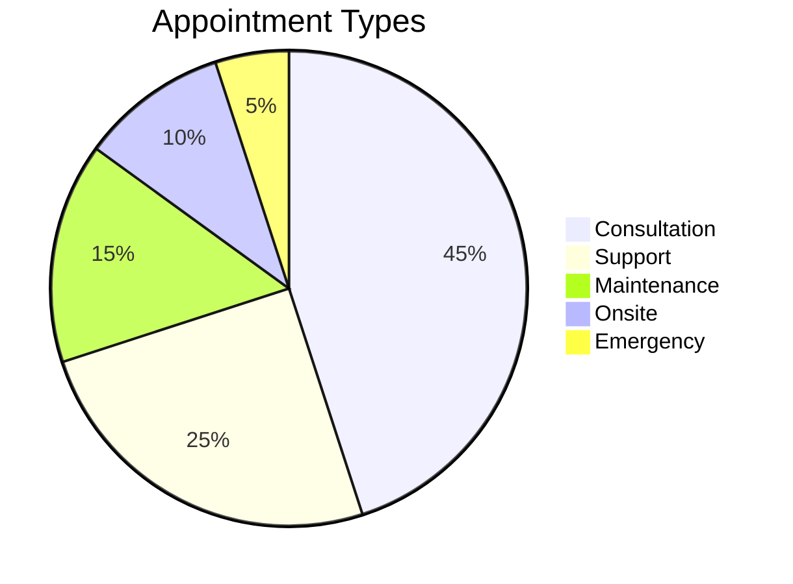

# AI Appointment Scheduler - Project Workflow

## Project Description

This project is an AI-powered appointment scheduling assistant built on the n8n workflow automation platform. It uses a voice AI assistant from Vapi to handle user interactions over the phone, and integrates with Google Calendar for scheduling and Twilio for sending SMS reminders.

## Kanban Board

| To Do | In Progress | Done |
|---|---|---|
| Implement appointment conflict handling | Develop appointment booking workflow | User authentication |
| Add support for more calendar providers | Integrate with Twilio for SMS reminders | Vapi voice assistant setup |
| Create a dashboard for analytics | Test appointment cancellation | Google Calendar integration |
| Improve error handling and reporting | Design conversation flow for rescheduling | OpenAI model integration |

## Workflow Tree



## Project Visualizations

Here are some more visual representations of the project, created using mermaid syntax.

### Detailed Kanban Board



### Sequence Diagram

This diagram shows the sequence of interactions between the different components of the system when a user books an appointment.



### Gantt Chart

This Gantt chart shows a sample timeline for the project.



### Pie Chart: Appointment Types

This pie chart shows a sample distribution of appointment types.



## Production Readiness Recommendations

Here are detailed instructions on how to implement the production-readiness recommendations for your AI Appointment Scheduler project.

### 1. Configuration Management

#### **Externalize Configuration**

**Goal:** Replace hardcoded values in your workflows with environment variables. This allows you to manage configuration for different environments (development, production) without changing the workflow itself.

**How-to:**

1.  **Set Environment Variables in n8n:**
    *   Access your n8n instance's settings. This is usually done through the UI, and the exact location might vary depending on your n8n version and hosting. Look for a section related to "Environment Variables" or "Instance Settings".
    *   Create new environment variables for each value you want to externalize. For example:
        *   `GOOGLE_CALENDAR_ID`: `quantumops9@gmail.com`
        *   `TWILIO_PHONE_NUMBER`: `+14694365607`
        *   `JWT_SECRET`: `thiscanbethestrongestpasswordicanset`
        *   `N8N_INSTANCE_URL`: `https://polarmedia.app.n8n.cloud`

2.  **Update Your n8n Workflows:**
    *   Open your workflows in the n8n editor.
    *   For each node that uses a hardcoded value, replace it with an expression that references the environment variable.
    *   **Example (Google Calendar Node):**
        *   **Go to** the "GCal (Check Availability)" node in your `Appointment Scheduling AI_v.0.0.3 (Prod)` workflow.
        *   **Find** the "Calendar" parameter.
        *   **Click** on the "Expression" tab (the `f(x)` icon).
        *   **Replace** the hardcoded email with `{{ $env.GOOGLE_CALENDAR_ID }}`.
    *   **Example (Twilio Node):**
        *   **Go to** the "Twilio (Send SMS)" node.
        *   **Find** the "From" parameter.
        *   **Replace** the hardcoded phone number with `{{ $env.TWILIO_PHONE_NUMBER }}`.
    *   **Example (JWT Secret in Code Node):**
        *   **Go to** the "Code (Decide Recovery)" node in the `Appointment Scheduling AI_v.0.0.3_vapi_recovery` workflow.
        *   **Find** the line `const SECRET = 'thiscanbethestrongestpasswordicanset';`.
        *   **Replace** it with `const SECRET = '{{ $env.JWT_SECRET }}';`.

#### **n8n Instance URL**

**Goal:** Update the `GEMINI.md` file with the correct n8n instance URL.

**How-to:**

The `appointment_scheduler/GEMINI.md` file has been updated to include the n8n instance URL.

### 2. Security

#### **Webhook Security**

**Goal:** Protect your webhooks from unauthorized access.

**How-to:**

1.  **Add a Secret to the Webhook Header:**
    *   When you call your webhook from Vapi (or any other service), add a custom header with a secret value. For example: `X-Webhook-Secret: your-super-secret-value`.
    *   You should store this secret value as an environment variable in your calling service (Vapi) and in n8n.

2.  **Verify the Secret in Your Workflow:**
    *   In your n8n workflow, the first node after the webhook trigger should be a "Code" node to verify the secret.
    *   **Add a new "Code" node** right after your "Webhook" node.
    *   **Add the following code** to the "Code" node:

    ```javascript
    const webhookSecret = '{{ $env.WEBHOOK_SECRET }}';
    const receivedSecret = $json.headers['x-webhook-secret'];

    if (receivedSecret !== webhookSecret) {
      // If the secret is missing or incorrect, stop the workflow
      // and return an error.
      $response.statusCode = 401;
      return { error: 'Unauthorized' };
    }

    // If the secret is correct, continue the workflow.
    return $items;
    ```

    *   This code will check for the secret in the webhook's headers. If it doesn't match, the workflow will stop and return a `401 Unauthorized` error.

### 3. Error Handling and Resilience

#### **Comprehensive Error Handling**

**Goal:** Prevent your workflows from failing unexpectedly and handle errors gracefully.

**How-to:**

1.  **Enable "Continue on Fail":**
    *   For any node that might fail (e.g., API calls, database queries), go to the **Settings** tab of the node.
    *   **Enable** the "Continue on Fail" option.

2.  **Create an Error Handling Branch:**
    *   After the node with "Continue on Fail" enabled, add an "If" node to check if an error occurred. The error information will be in the `$error` variable.
    *   **Condition for the "If" node:** `{{ $error !== undefined }}`
    *   **In the "true" branch of the "If" node,** you can add nodes to:
        *   **Log the error:** Use a "Code" node to `console.log($error)`.
        *   **Send a notification:** Use a "Gmail" or "Slack" node to send the error details to an administrator.
        *   **Return a custom error message:** Use a "Respond to Webhook" node to send a user-friendly error message.

#### **Input Validation**

**Goal:** Ensure that the data received by your webhooks is valid before processing it.

**How-to:**

1.  **Add a "Code" Node for Validation:**
    *   Place a "Code" node at the beginning of your workflow, right after the webhook trigger and security check.

2.  **Write Validation Logic:**
    *   In the "Code" node, write JavaScript to check the incoming data.
    *   **Example:**

    ```javascript
    const body = $json.body;

    if (!body.phone || typeof body.phone !== 'string') {
      $response.statusCode = 400;
      return { error: 'Bad Request: Missing or invalid phone number.' };
    }

    if (!body.startIso || !/^\d{4}-\d{2}-\d{2}T\d{2}:\d{2}:\d{2}/.test(body.startIso)) {
      $response.statusCode = 400;
      return { error: 'Bad Request: Missing or invalid startIso.' };
    }

    return $items;
    ```

    *   This code checks for the presence and format of `phone` and `startIso`. If the validation fails, it returns a `400 Bad Request` error.

### 4. Testing

#### **Automated Testing**

**Goal:** Create a suite of automated tests to run against your workflows.

**How-to:**

1.  **Create a New "Test" Workflow:**
    *   Create a new workflow named something like `[Test] Appointment Scheduling`.

2.  **Use the "Execute Workflow" Node:**
    *   In your test workflow, use the "Execute Workflow" node to call the workflow you want to test (e.g., `Appointment Scheduling AI_v.0.0.3 (Prod)`).

3.  **Provide Test Data:**
    *   In the "Execute Workflow" node, provide different sets of input data to simulate various scenarios (e.g., a valid booking, a booking for a taken slot, a booking outside business hours).

4.  **Assert the Results:**
    *   After the "Execute Workflow" node, add "Code" nodes to check if the output is what you expected.
    *   **Example:**

    ```javascript
    const result = $items[0].json;

    // Test case: Booking a taken slot
    if (result.result !== 'no_free_slot') {
      throw new Error('Test failed: Expected no_free_slot, but got ' + result.result);
    }

    console.log('Test passed: Booking a taken slot');
    return { success: true };
    ```

#### **End-to-End Testing**

**Goal:** Test the entire system from the user's perspective.

**How-to:**

1.  **Simulate a Phone Call:**
    *   Use a tool like `curl` or Postman to send a request to your Vapi webhook, simulating an incoming phone call.
2.  **Follow the Conversation Flow:**
    *   Your Vapi assistant will respond. You will then need to send subsequent requests to the webhook to simulate the user's responses in the conversation.
3.  **Verify the Outcome:**
    *   Check that the appointment is correctly created in Google Calendar, that the SMS reminders are sent, and that all other expected actions are performed.

### 5. Observability and Monitoring

#### **Logging**

**Goal:** Add detailed logging to your workflows to help with debugging.

**How-to:**

*   In any "Code" node, you can use `console.log()` to log information. This will appear in the n8n editor's execution log.
*   **Example:**

```javascript
console.log('Checking availability for:', $json.startIso);
const gcalItems = $items("GCal (Check Availability)");
console.log('Google Calendar response:', gcalItems);
return $items;
```

#### **Monitoring**

**Goal:** Monitor the health and performance of your n8n instance.

**How-to:**

*   **n8n Monitoring:** n8n provides some basic monitoring features in its UI. Check the "Executions" list to see the status of your workflow executions.
*   **External Monitoring Tools:** For more advanced monitoring, you can use external tools like Prometheus, Grafana, or Datadog. You would need to configure your n8n instance to expose metrics to these tools. This is an advanced topic that depends on your hosting environment.

### 6. Code Quality and Maintainability

#### **Code in Nodes**

**Goal:** Keep the code in your "Code" nodes clean and maintainable.

**How-to:**

*   **Keep it Simple:** For simple data transformations, a "Code" node is fine.
*   **Add Comments:** For any complex logic, add comments to explain what the code is doing.
*   **Consider Externalizing:** If you have a lot of complex business logic, consider moving it to an external service (e.g., an AWS Lambda function, a Google Cloud Function, or your own API). You can then call this service from your n8n workflow using the "HTTP Request" node.

#### **Workflow Organization**

**Goal:** Keep your workflows organized and easy to understand.

**How-to:**

*   You are already doing a good job of this by using a main workflow and sub-workflows.
*   **Continue this practice.** Keep each workflow focused on a single, well-defined task.
*   **Use descriptive names** for your workflows and nodes.
