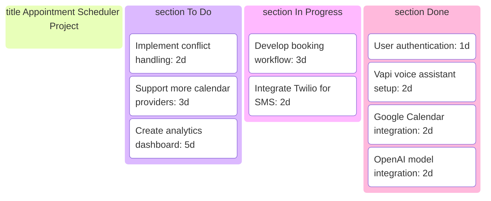
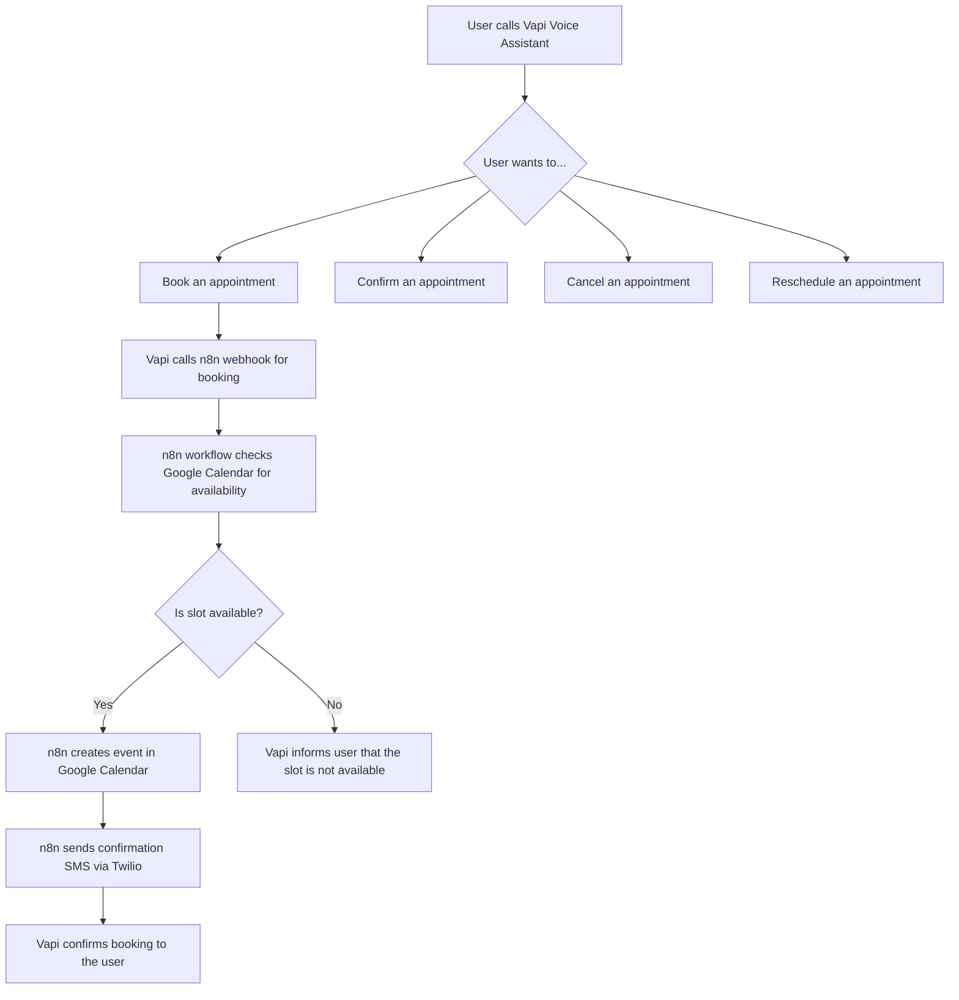
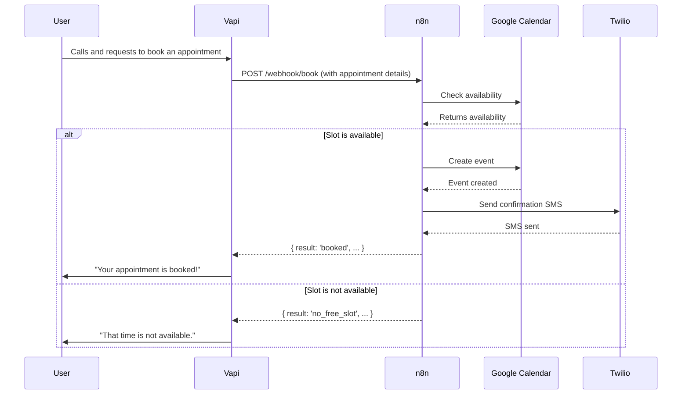
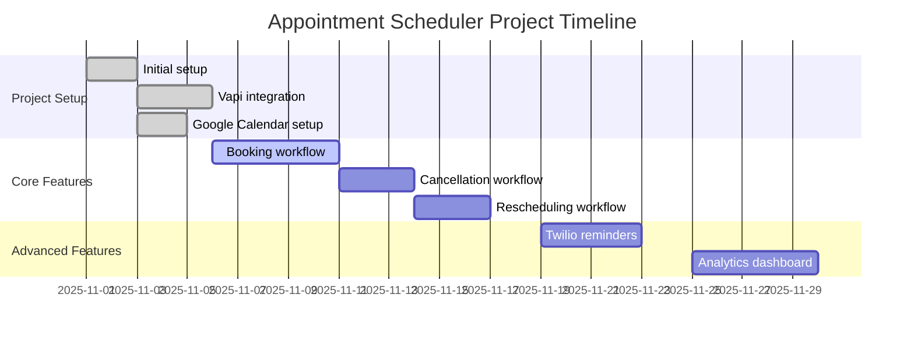
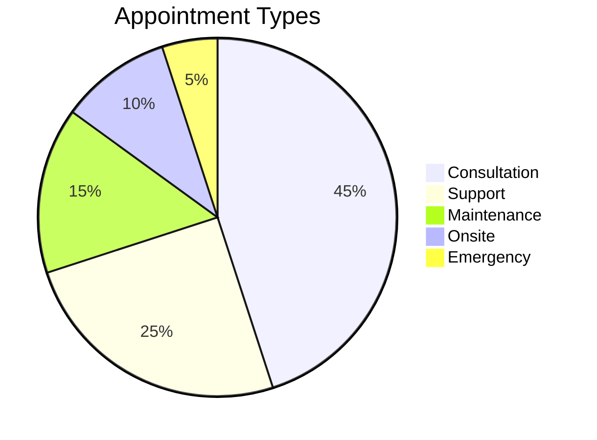

# AI Appointment Scheduler

---

## Project Description

This project is an AI-powered appointment scheduling assistant built on the n8n workflow automation platform. It uses a voice AI assistant from Vapi to handle user interactions over the phone, and integrates with Google Calendar for scheduling and Twilio for sending SMS reminders.

---

## Kanban Board

---

## Workflow Tree

---

## Sequence Diagram

---

## Gantt Chart

---

## Pie Chart: Appointment Types

---

## Production Readiness

For detailed instructions on how to make this project production-ready, please refer to the `Project_Workflow.md` file.
